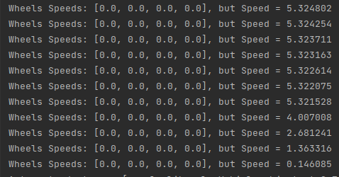

# REASIM-Carla
SSS'23 Reasoned Simulation (REASIM) - CARLA Simulations

Runs a simulation of a Car accelerating on a straight road, braking, then attempting to open the doors when the car controller thinks it has stopped. The controller assumes the car has stopped when the wheel speed is 0. However, due to a slippery section on the road, the car can slide with non-zero velocity, even when wheels are stationary.

## Project Setup

### Building Telemetry Branch from Source
Our script leverages wheel speed information taken from lower-level unreal telemetry data. Telemetry data access is not exposed in the mainline CARLA release, so will need to build the [joel-mb/telemetry_data](https://github.com/carla-simulator/carla/tree/joel-mb/telemetry_data) branch from source.

Instructions to Build CARLA from Source are [here](https://carla.readthedocs.io/en/latest/build_linux/).

Hopefully it will be merged ([See pull request](https://github.com/carla-simulator/carla/pull/5153)) into the dev nighly-release branch soon. For now, we must build ourselves!

### Setting up PYTHONPATH

Add the following to your `PYTHONPATH`:

    ${CARLA_ROOT}/PythonAPI`
    ${CARLA_ROOT}/PythonAPI/carla`
    ${CARLA_ROOT}/PythonAPI/carla/agents`
    ${CARLA_ROOT}/PythonAPI/carla/dist/${CARLA-PYTHON_VERSION}.egg`

## Running Scripts

Run the Carla Server via 

    ${CARLA_ROOT}/CarlaUE4.sh

In other terminal, run 

    python slippyDoorOpen.py

Which will run three simulations, each with a different friction value for the highlighted friction zone:
- Friction = 1.0
- Friction = 0.5
- Friction = 0.0

---
### Friction = 1.0

---

### Friction = 0.0

#### Console Output
